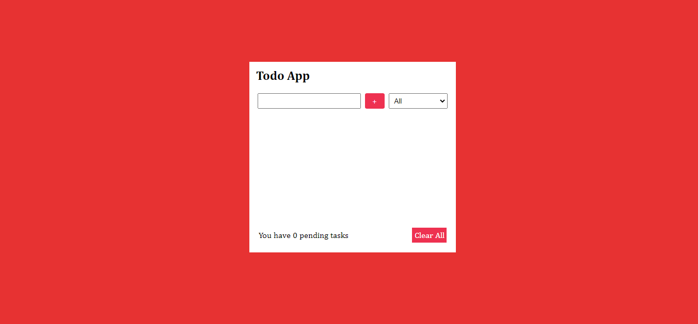
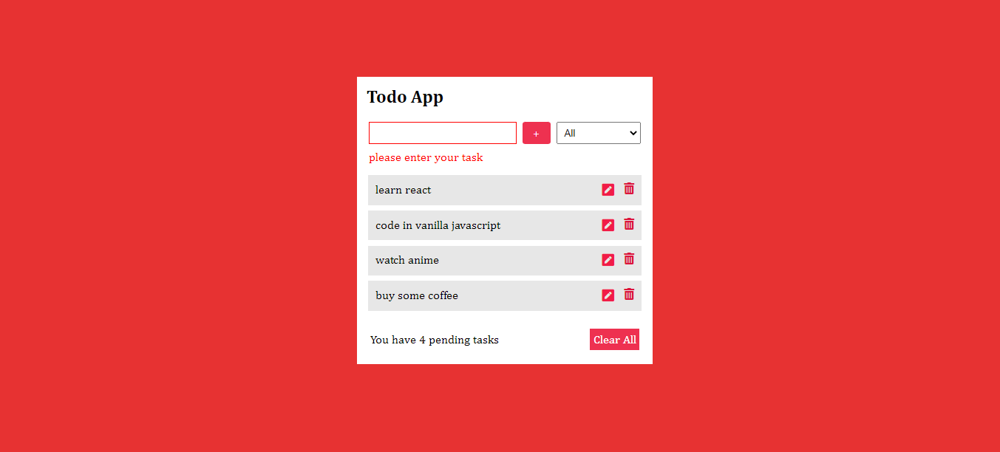
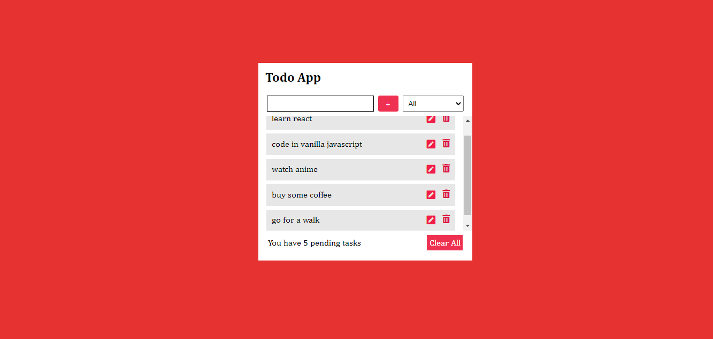
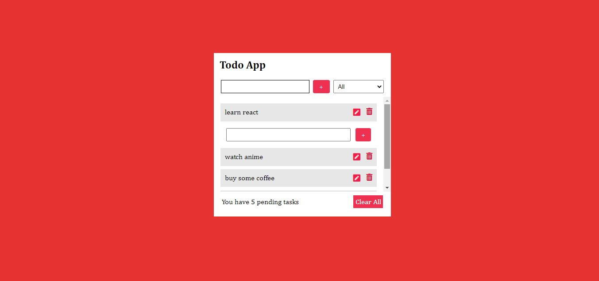
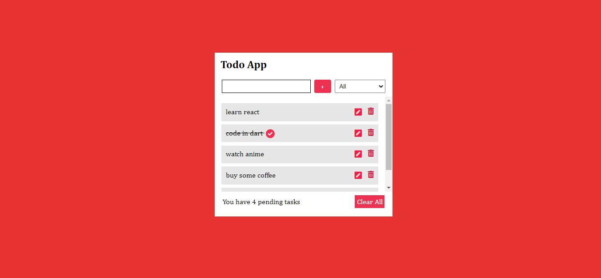
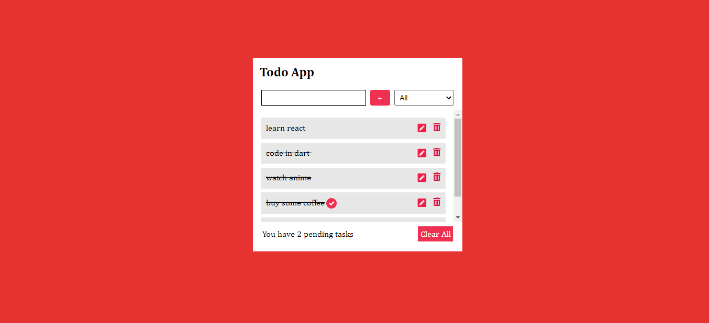
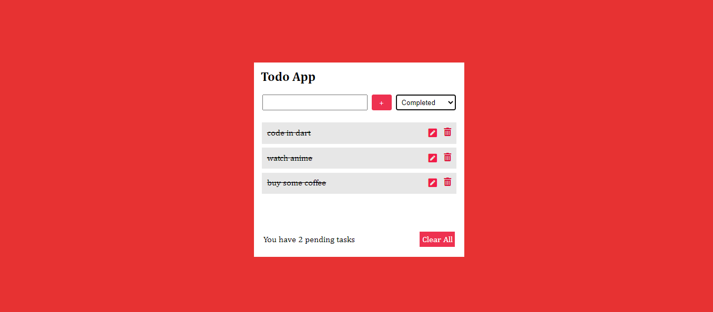
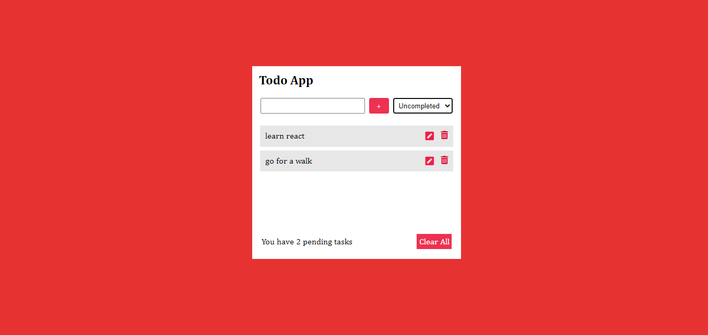
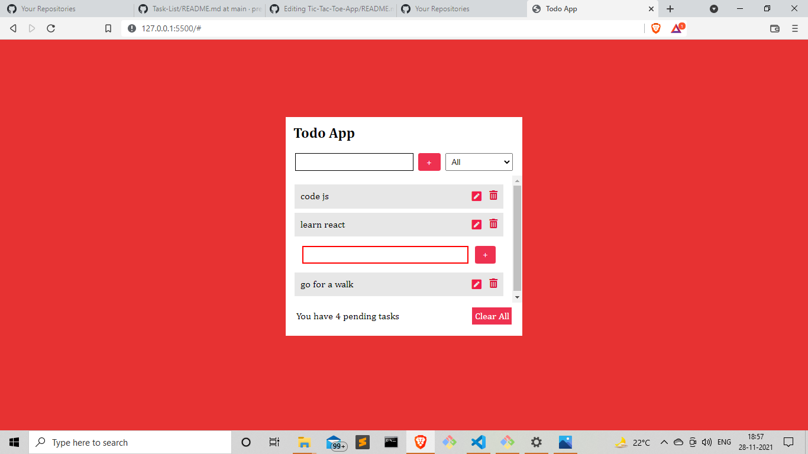

**TO-DO APP** : :jack_o_lantern:
A web app that is built with **HTML5,CSS3 & Vanilla JAVASCRIPT**  

> Note : Make sure you have the internet connection to render icons.

## Table of contents
- [General Info](#General-Info-)
- [Screenshots](#screenshots-)
- [Preview](#preview-)
- [Installation](#Installation-)
- [Technologies](#Technologies-Used-)

## 1. General Info 📝
The purpose of this project is to understand and implement the javascript concepts that i've learned to make the user interface look appealing besides having fun along the journey :smiley:.

## 2. Screenshots 📸











## 3. Preview 🎥

## 4. Installation 📀

#### Clone the repo

```sh
$ git clone https://github.com/preetamvarun/Task-List.git
$ cd Task-List/
```

#### Run the app
```sh
open index.html with a browser you prefer
```
## 5.Technologies Used ✳️

[](https://devdocs.io/javascript/)   
[](https://devdocs.io/html/)   
[](https://devdocs.io/css/)   

