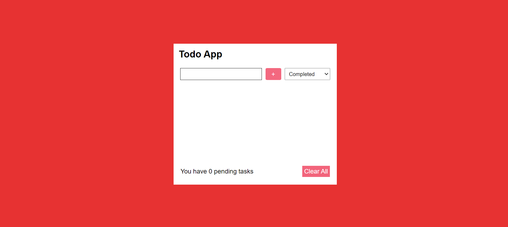
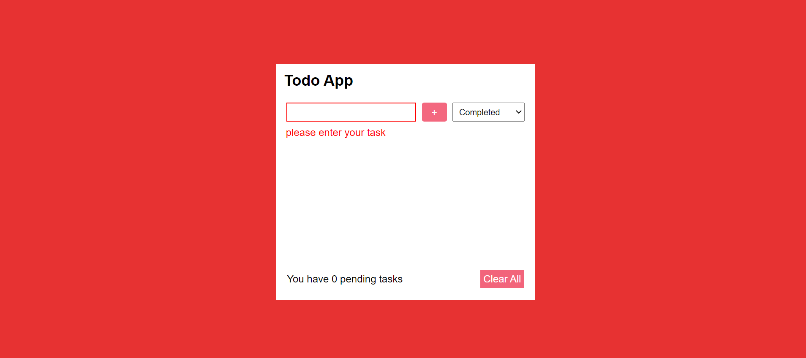
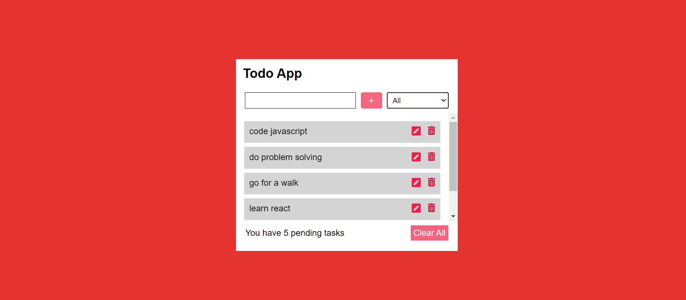
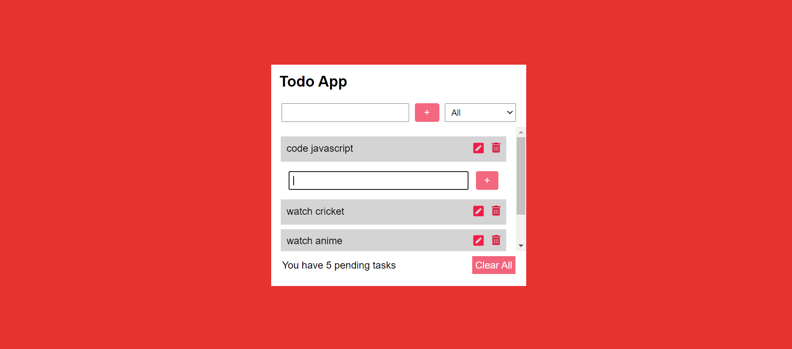
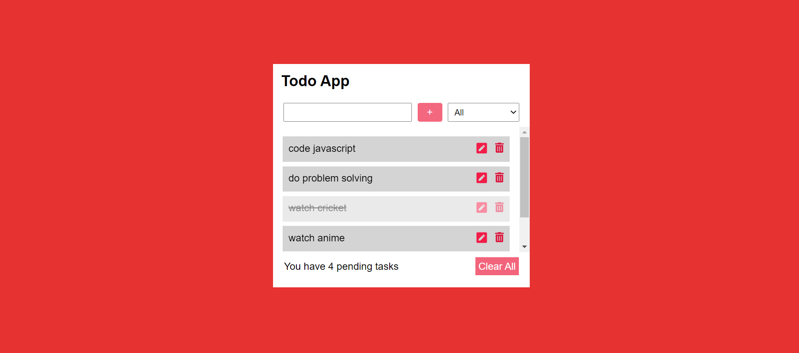
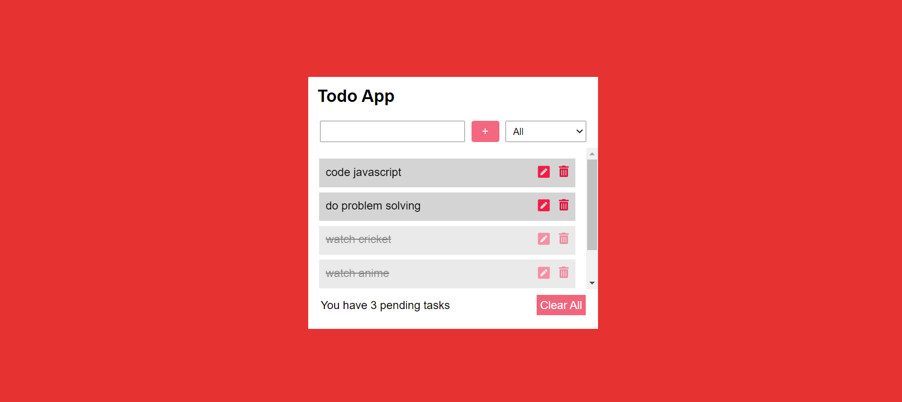
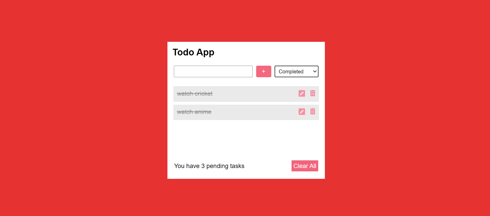
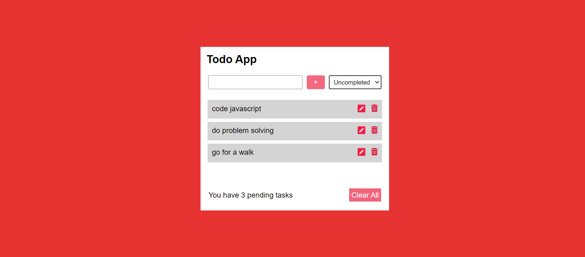
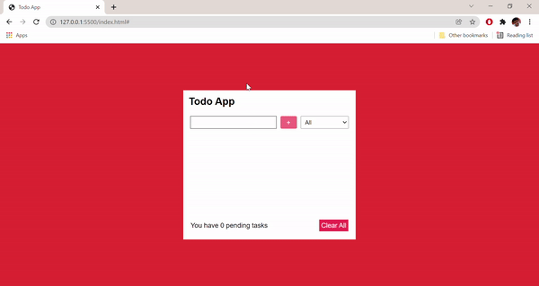
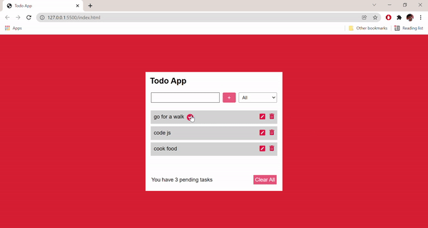

**TO-DO APP** : :jack_o_lantern:
A web app that is built with **HTML5,CSS3 & Vanilla JAVASCRIPT**  

> Note : Make sure you have the internet connection to render icons.

## Table of contents
- [General Info](#GeneralInfo)
- [Screenshots](#screenshots)
- [Preview](#preview)
- [Installation](#Installation)
- [Technologies](#Tech)
- [Features](#Features)
- [liveDemo](#liveDemo)

<a name = "GeneralInfo"> </a>
## 1. General Info 📝
The purpose of this project is to understand and implement the javascript concepts that i've learned to make the user interface look appealing besides having fun along the journey :smiley:.

<a name = "screenshots"> </a>
## 2. Screenshots 📸









<a name = "preview"> </a>
## 3. Preview 🎥




<a name = "Installation"> </a>
## 4. Installation 📀

#### Clone the repo

```sh
$ git clone https://github.com/preetamvarun/Task-List.git
$ cd Task-List/
```

#### Run the app
```sh
open index.html with a browser you prefer
```

<a name = "Tech"> </a>
## 5.Technologies Used ✳️


<a name = "Features"> </a>
## 6. Features
Add tasks ➕ <br>
Edit tasks ✍️ <br>
Filter tasks 🔍 <br>
delete tasks 🗑️ <br>
check off tasks ✅ <br>
local storage 🗃️ <br>
User friendly 🔥 <br>
cool animations ☘️

<a name = "liveDemo"> </a>
## live demo 👾
https://tasks-record.netlify.app/

